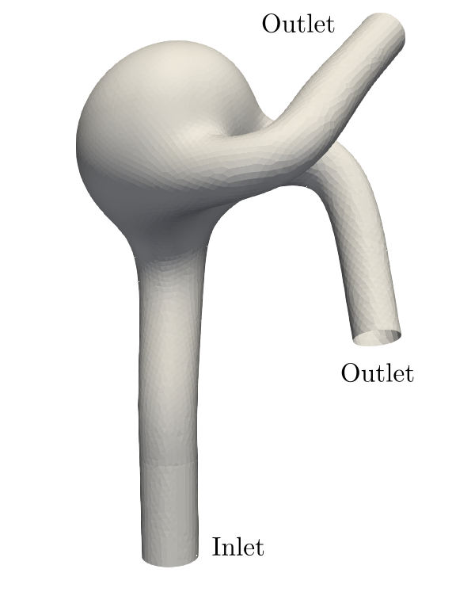

# Flow inside a synthetic 3D aneurysm

This is an interior flow containing a variable number
of in/outlets. The simulation is completely set up
thanks to an `XML` file (`param.xml` here). The
computation domain is sparsely allocated. The boundary
conditions (BCs), generated from an STL file, are off-lattice of the Guo type for the `aneurysm.cpp`
file and Bounce-Back for the `aneurysm_bounceback.cpp` file.



The simulation is a multi-grid simulation. The complete grid
is starting from a coarse grid and is refined
by a factor of two at each intermediate convergence (the number
of refinements and the convergence criterion are the
`maxLevel` and `epsilon` fields in the `param.xml` file).
The simulation is stationary and one can enforce
either a Poiseuille (the inlet is assumed to have a circular shape) or a "Plug" (constant along the normal of
tja inlet) see the `poiseuilleInlet` in `param.xml` for modifying this setting. The outlets have a constant pressure. The in/outlets are identified by "holes"
in the STL file. The holes are sorted according to a direction
specified the the `param.xml` file which is 2 in the present example ($`0: x, 1: y, 2: z`$) and the respective numbering corresponds to the order specified in the `type` field of the XML file.

In this simulation macroscopic fields are measured a specific locations using "probes". This is a bit of an uncommon
way to access specific locations in a fluid simulation
but is mandatory in Palabos, because of the parallel nature of the
library.

## Concepts used in this example

* Reading parameters from an XML file (see `readParameters()`).
* Generate voxels from STL file through triangle sets.
* Sparse block allocation from voxels
  
    ```CPP
    generateMultiBlockLattice<T,DESCRIPTOR> (
                voxelizedDomain.getVoxelMatrix(), envelopeWidth, dynamics );
    ```
* Set custom velocity/pressure on in/outlets (see `setOpenings()`).
* Instantiation of Guo (`GuoOffLatticeModel3D`) off-lattice (`OffLatticeBoundaryCondition3`) BCs. To increase numerical efficiency, external density/velocity are stored in the `rhoBarJfield` NTensorField.
* Use of `MultiNTesorField3D`, `MultiScalarField3D`, `MultiTesorField3D` for post-processing and dynamics.
* Use of `ValueTracer` to check for convergence.
* Boundary conditions used to get statistics on a sparse domain.
* VTK volume output and Gif slices.
* Surface VTK output (`writeSurfaceVTK()`).
* Measures on specific points (see `pointMeasures()`).
* Refine complete lattice by using interpolations `refine()`.

## Before running

Before being able to run this test case you need to unzip
the aneurysm geometry. Under linux systems you can do

```
tar -xzvf aneurysm.stl.tgz
```
