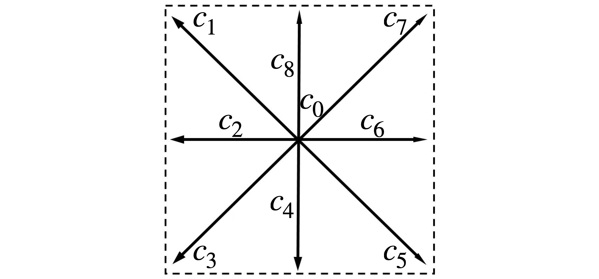
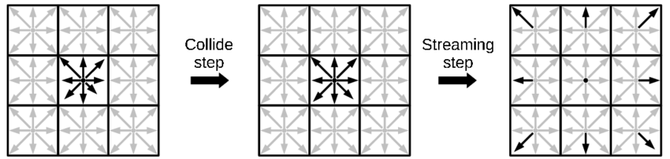
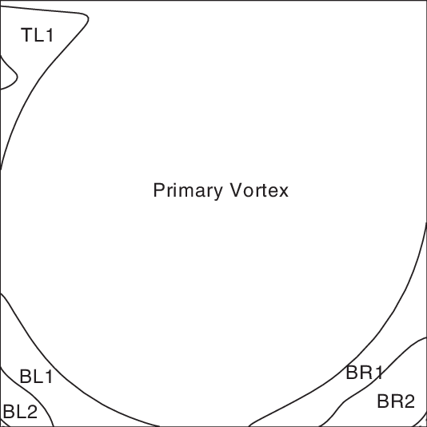
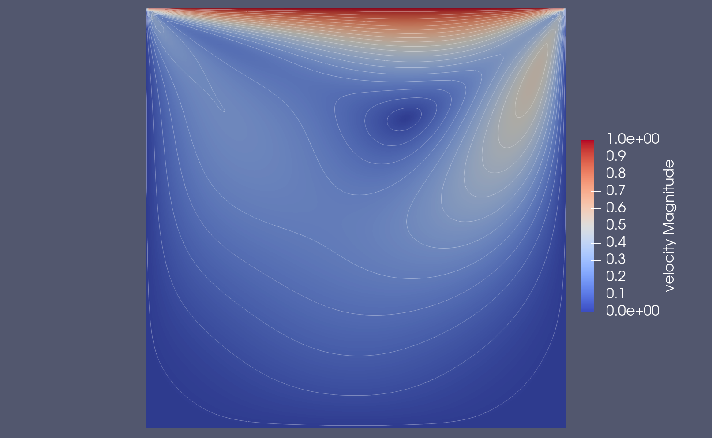

# Lid driven cavity in 2D

## Introduction

This is probably your first contact with Palabos. This example is a simulation of the famous numerical benchmark of the two-dimensional lid-driven cavity. To run the code on Linux use:

```bash
$ cd build
$ cmake ..
$ make
$ cd ..
$ ./cavity2d
```

If you are interested in some theory behind the [lattice Boltzmann method](#derivation) and the [2D cavity](#lid-driven-cavity) example read the [theory paragraph](#theory). How the theory is implemented in Palabos can be read in the [implementation paragraph](#implementation).
If you are only interested in verifying your installation, you can double-check the output vtk-files and the figure in the [last paragraph](#result).

## Theory

The lattice Boltzmann method (LBM) was derived from the lattice gas automata in the 1990s and is a way to simulate fluid flows. The method simulates the streaming and colliding of particles densities instead of classically solving the Navier-Stokes equation. For a detailed description of the topic we recommend the book of [Krueger et al.](https://www.researchgate.net/publication/306037799_The_Lattice_Boltzmann_Method_-_Principles_and_Practice)
This section contains a shorted version of the [derivation](#derivation) and [discretization](#discretization) of the lattice Boltzmann equation from [U. D. Schiller](https://www.researchgate.net/publication/270576716_Thermal_fluctuations_and_boundary_conditions_in_the_lattice_Boltzmann_method) as well as an explanation of the [lid driven cavity in 2D](#lid-driven-cavity).

### Derivation

The distribution function $`f(\textbf{r},\textbf{u},t)`$ specifies the probability that a particle with velocity $`\textbf{u}`$ is found at position $`\textbf{r}`$ at time $`t`$. In the continuum the time evolution of the distribution function $`f`$ is given by

```math
\biggl(\frac{\partial}{\partial t} + \textbf{c}\cdot \frac{\partial}{\partial \textbf{r}} + \frac{\textbf{F}}{m}\cdot \frac{\partial}{\partial\textbf{c}}\biggr) f(\textbf{r},\textbf{c},t) = 0
```

where $`\textbf{F}`$ is an external force acting on a particle with mass $`m`$. This equation does not describe any collisions of particles or interactions with their neighborhood. Therefore, a collision operator $`\mathcal{C}`$ is introduced. This leads to

```math
\biggl(\frac{\partial}{\partial t} + \textbf{c}\cdot \frac{\partial}{\partial \textbf{r}} + \frac{\textbf{F}}{m}\cdot \frac{\partial}{\partial\textbf{c}}\biggr) f(\textbf{r},\textbf{c},t) = \mathcal{C}[f].
```

The local equilibrium of the fluid is given by the Maxwell distribution function

```math
f^{eq}(\textbf{c}) = \biggl(\frac{m}{2\pi k_BT}\biggr)^{\frac{3}{2}}\frac{\rho}{m}exp\biggl(-\frac{m(\textbf{c} - \textbf{u})^2}{2k_BT}\biggr)
```

where $`\rho`$ is the density, $`\textbf{u}`$ is the mean velocity, $`T`$ is the temperature and $`k_B`$ is the [Boltzmann constant](https://en.wikipedia.org/wiki/Boltzmann_constant). The property $`\mathcal{C}[f^{eq}] = 0`$ is fulfilled by the Maxwell distribution function. Assuming that the real distribution function is locally only slightly different from the local equilibrium distribution, the distribution function $`f`$ can be split into

```math
f = f^{eq} + f^{neq}.
```

As a result, we can approximate the collision operator $`\mathcal{C}`$ by using a linear operator $`\mathcal{C_L}`$. It simplifies into $`\mathcal{C}[f] = \mathcal{C_L}f^{neq}`$. The most commonly used linear operator is the [BGK-operator](https://journals.aps.org/pr/abstract/10.1103/PhysRev.94.511). It is given by

```math
\mathcal{C}_{BGK}f^{neq} = -\omega f^{neq}.
```

The operator assumes that during the time interval $`dt`$ some part of the particles dependent on $`\omega`$ relaxes towards the equilibrium.

### Discretization

Assuming there is no external force ($`\text{F}\equiv 0`$) and using the BGK-operator, the Boltzmann equation can be written as

```math
\frac{\partial}{\partial t}f + \textbf{c}\cdot\frac{\partial}{\partial\textbf{r}}f = -\omega(f-f^{eq}).
```

The velocity space can be discretized by using the Hermite expansion of the distribution function and Gaussian-quadrature.
For each discrete velocity $`\textbf{c}_i`$ the equation transforms into

```math
\frac{\partial}{\partial t}f_i +\textbf{c}_i\cdot\frac{\partial}{\partial\textbf{r}}f_i = -\omega(f_i-f_i^{eq})
```

where $`f_i`$ is only dependent on space and time. The Maxwell-distribution function can be discretized to

```math
f_i^{eq}=\omega_i\rho\biggl(1+\frac{\textbf{u}\cdot\textbf{c}_i}{c_s^2} + \frac{(\textbf{u}\cdot\textbf{c}_i)^2}{2c_s^4} - \frac{|\textbf{u}|^2}{2c_s^2}\biggr)
````

with the speed of sound $`c_s`$ and a directional weight $`\omega_i`$ by using the Hermite-expansion.
In 2D, the space is discretised in 9 different streaming directions $`\textbf{c}_i`$, leading to the D2Q9 model:



The associated basis vectors $`\textbf{c}_i`$ are dimensionless and given by the columns of $`C`$

```math
 C = \left( \begin{array}{rrrrrrrrrrrrrrrrrrrr}
0 & -1 & -1 & -1 & 0 & 1& 1 & 1 & 0\\
0 & 1 & 0 & -1 & -1 & -1 & 0 & 1 & 1 
\end{array}\right)
```

The weights are given by
```math
\begin{aligned}
\omega_i&=\frac{4}{9} &\text{ for } \textbf{c}_i^2 &= 0, \\
\omega_i &= \frac{1}{9} & \text{ for } \textbf{c}_i^2 &= 1, \\
\omega_i &= \frac{1}{36} &\text{ for } \textbf{c}_i^2 &= 2.
\end{aligned}
```

There exist more complicated models for 3D e.g the D3Q15 or D3Q19 models. Discretization according to space and time leads to the lattice Boltzmann equation

```math
f_i( \textbf{r} + dt\textbf{c}_i, t + dt) = f_i( \textbf{r}, t) - \omega\bigl(f_i( \textbf{r}, t) + f_i^{eq}( \textbf{r}, t)\bigr).
```

The lattice Boltzmann equation is typically divided into two steps:

* In the collision step new particle density values are computed: 

```math
f_i(\textbf{r}, t + dt) = f_i(\textbf{r}, t) - \omega\bigl(f_i(\textbf{r}, t) - f_i^{eq}(\textbf{r}, t)\bigr)
```

* In the streaming step the new values are sent to neighbour cells: 

```math
 f_i(\textbf{r} + dt\textbf{c}_i, t + dt) = f_i(\textbf{r}, t + dt)
```



### Boundary conditions

In general, there exist two types of boundary conditions:

* Dirchilet conditions which set the velocity $`\textbf{u}=(u_x,u_y)`$ on the boundary

* Neumann conditions which set the velocity rate $`\frac{\partial}{\partial\textbf{n}}\textbf{u}`$ with the boundary normal vector $`\textbf{n}`$

Note that this example only uses Dirichlet boundary conditions.

### Lid driven cavity

Studied by [Ghia et. al.](http://www.msaidi.ir/upload/Ghia1982.pdf) back in 1982, the two-dimensional lid driven cavity example became very popular to measure performance and accuracy of numerical flow simulations. The domain consists of an open cavity. While the top lid is driven with a velocity $`\textbf{u}=(U, 0)`$, the velocities on all the other boundaries are set to $`\textbf{u}= (0,0)`$.


Depending on the [Reynolds number](https://en.wikipedia.org/wiki/Reynolds_number) of the flow, the simulation results in one large primary vortex and several eddies in the corners. The larger the Reynolds number the bigger get the vortices in the top-left (TL), bottom-left (BL), and bottom-right (BR) corners. For a more detailed explanation, the original paper of [Ghia et. al.](http://www.msaidi.ir/upload/Ghia1982.pdf) is a good read.



## Implementation

This section describes how the lid driven cavity example is coded in Palabos, by connecting the theory from the [previous paragraph](#theory) to the naming scheme of Palabos. At first, there is to mention, that this code structure is parallel by default and can run on any multi-processor machine.<br>
The simulation domain/lattice is created with an instance of the `MultiBlockLattice2D` class. The arguments include the dynamic model, in this case, the BGK collision model (`BGKdynamics()`). It is also important to specify the model descriptor, in this case, the `D2Q9Descriptor` (line 125-127). Note that `Nx` and `Ny` are the number of cells in $`x`$ and $`y`$ direction and thus the size of the simulation domain. 

```cpp
MultiBlockLattice2D<T, DESCRIPTOR> lattice(
 parameters.getNx(), parameters.getNy(),
 new BGKdynamics<T, DESCRIPTOR>(parameters.getOmega()));
```

The boundary condition instance is created with the `OnLatticeBoundaryCondition2D` class. In this example, finite-difference regularized boundary conditions are installed with `createInterpBoundaryCondition2D` ([Skordos boundary condition](https://journals.aps.org/pre/abstract/10.1103/PhysRevE.48.4823)), which increase the accuracy on straight walls (line 131). Note that one can change the boundary conditions to local, by commenting `createInterpBoundaryCondition2D` and uncommenting `createLocalBoundaryCondition2D` (line 130).

```cpp
OnLatticeBoundaryCondition2D<T, DESCRIPTOR> *
 // boundaryCondition = createLocalBoundaryCondition2D<T,DESCRIPTOR>();
 boundaryCondition = createInterpBoundaryCondition2D<T, DESCRIPTOR>();
```

In the method `cavitySetup` (line 58-76) the lattice is then initialized. First, the boundary condition type is set on the on-lattice boundary via the method `setVelocityConditionOnBlockBoundaries()` to a Dirichlet boundary condition. Then, a constant velocity is set on the boundaries (`setBoundaryVelocity()`), and the cells are initialized with constant density and velocity by the method `initializeAtEquilibrium()`. To set the velocity $`U`$ at the top, a `Box2D` object is used to handle the subdomain (line 71). The other boundaries are initialized with velocity zero (line 67).

```cpp
setBoundaryVelocity(lattice, lattice.getBoundingBox(), Array<T, 2>((T)0., (T)0.));

T u = parameters.getLatticeU();
setBoundaryVelocity(lattice, Box2D(1, nx - 2, ny - 1, ny - 1), Array<T, 2>(u, (T)0.));

```

The next simulation step in the main method (line 101-177) is a for-loop over the timesteps in which the `collideAndStream()` (line 161) method is used on the lattice once every iteration. Inside this method happens the entire computation i.e the collision in each cell and then the propagation of newly computed values to neighbor cells.
Before calling `collideAndStream()` the current velocity is stored in two output files at certain time steps. <br>
In `writeGif()` (line 78-89) the method `writeScaledGif()` is used to store the computed velocity norm (`computeVelocityNorm()`) in a .gif image. 

```cpp
template <class BlockLatticeT>
void writeGif(BlockLatticeT &lattice, plint iter)
{
 const plint imSize = 600;

 ImageWriter<T> imageWriter("leeloo");
 imageWriter.writeScaledGif(
 createFileName("uNorm", iter, 6), *computeVelocityNorm(lattice), imSize, imSize);
 imageWriter.writeScaledGif(
 createFileName("logUnorm", iter, 6),
 *computeLog(*add((T)1.e-8, *computeVelocityNorm(lattice))), imSize, imSize);
}

```

In the other method (`writeVTK` line 91-99), the class `ParallelVtkImageOutput2D` is used to generate a .vti file that allows to store the velocity and velocity norm (`computeVelocity()`, `computeVelocityNorm()`). With the help of the `IncomprFlowParam<T> const &parameters` instance the method obtains the cell width `dx` and time step size `dt` to convert the velocity to the macro system. 

```cpp
template <class BlockLatticeT>
void writeVTK(BlockLatticeT &lattice, IncomprFlowParam<T> const &parameters, plint iter)
{
 T dx = parameters.getDeltaX();
 T dt = parameters.getDeltaT();
 VtkImageOutput2D<T> vtkOut(createFileName("vtk", iter, 6), dx);
 vtkOut.writeData<float>(*computeVelocityNorm(lattice), "velocityNorm", dx / dt);
 vtkOut.writeData<2, float>(*computeVelocity(lattice), "velocity", dx / dt);
}
```

After the computation step, the average quantities are printed with the help of the methods `getStoredAverageEnergy()` and `getStoredAverageDensity()` (line 164 and 165). With `global::timer()` (line 172) the computation time is measured.
Every 1280 iteration steps the an output is printed to the console:

```bash
step 0; t=0; av energy=3.81587645e-07; av rho=1
Time spent during previous iteration: 0
step 1280; t=0.1; av energy=1.143114423e-06; av rho=0.9999958713
Time spent during previous iteration: 0.000588
Saving Gif ...

Saving VTK file ...
```

It shows the current iteration step, the current time step, the average energy, and density as well as the previous iteration time. Note that only every 2560 iteration steps a .gif file and only every 12800 iteration steps a .vti file is written.

## Result

Running `./cavity2D` writes some output files into the `tmp` directory. Opening the files in ParaView should produce a plot similar to this:



It shows the visualization of the final time step of the simulation. The magnitude of the velocity is plotted in the 2D cavity and some contour lines are added to show the vortex structures. Note that due to the low Reynolds number (Re = 100) only the primary vortex is visible.
