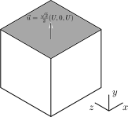

# Lid driven cavity in 3D

This example is the simulation of the famous numerical benchamrk of the threee dimensional lid-driven cavity.

The top lid is driven with a velocity $`\vec u=\frac{\sqrt{2}}{2}(U, 0, U)`$ while
all the other boundaries have velocity $`\vec u=\vec 0`$.

## Concepts use in this example

1. Creation of a simluation domain (`MultiBlockLattice3D()`) with the BGK collision model (`BGKdynamics()`).
2. Instatioation of regularized boundary conditions `createLocalBoundaryCondition2D`.
3. Setting on-lattice velocity boundaries on all the domain boundaries (`setVelocityConditionOnBlockBoundaries()`).
4. Setting a constant velocity on a boundary (`setBoundaryVelocity()`).
5. Initializing populations with constant density and velocity (`initializeAtEquilibrium()`).
6. Use of `Box3D` objects to handle simulation subdomains.
7. Output `gif` images on simulation slices (`writeScaledGif()`).
8. Ouput `vtk` files (`ParallelVtkImageOutput3D`, `writeData()`).
9. Coputation of velocity, norm and vorticivy (`computeVelocity()`, `computeVelocityNorm()`, `computeVorticity()`).
10. Use of units helper functions `IncomprFlowParam`.
11. Timestep progression `collideAndStream()`.
12. Computation of average quantities `getStoredAverageEnergy()` and `getStoredAverageDensity()`.
13. Time measurement `global::timer()`.