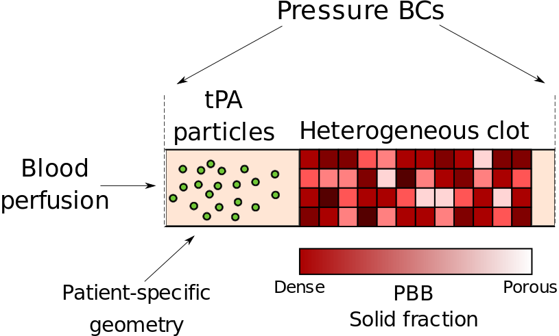
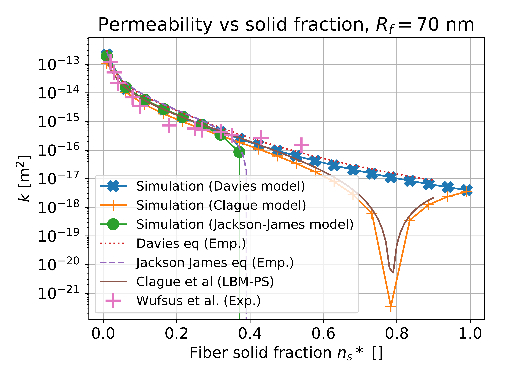

<script type="text/x-mathjax-config">
  MathJax.Hub.Config({
    tex2jax: {
      inlineMath: [ ['$','$'], ["\\(","\\)"] ],
      processEscapes: true
    }
  });
</script>

# The Partially Saturated Method

This example guides you through an implementation of the *Partially Saturated Method* or *Partial Bounce-Back* (PBB). In brief, this method consists of simulating voxels that block part of the incoming *populations*. This blocking fraction is commonly called the *solid fraction*.
The problem simulates the breakdown of a fibrin thrombus. We simulate a Poiseuille flow driven by a pressure drop, inside a cylinder representing an artery. The thrombus, is a porous medium represented with partially saturated voxels, using the PBB method.
<center>
<br/>

<br/>
</center>

The method implemented is the one given by Walsh et al. ([https://doi.org/10.1016/j.cageo.2008.05.004](https://doi.org/10.1016/j.cageo.2008.05.004)), and which can be summarized in the following way: 

```math
f_i^{out}(x,t) = (1-\gamma)f_i^c(x,t) + \gamma f_{\hat{i}}^{in}(x,t)
```
with $`f_i^{out}(x,t)`$ the outgoing populations after the PBB step, in lattice direction $`i`$, at position $`x`$ and time $`t`$, $`f_i^c(x,t)`$ the populations immediately after the fluid collision step, and $`f_{\hat{i}}^{in}(x,t)`$ the incoming fluid packet before the collision step, in direction $`-i`$. $`\gamma`$ is the model solid fraction, which varies from **0** (completely **fluid** node) to **1** (completely **solid** node). 
<center>
<br/>

<br/>
</center>

Walsh et al. show that, with this method, $`\gamma`$ is related to the permeability $`k`$ of the PBB voxel as follows:
```math
k = \frac{(1-\gamma)\nu\,dt}{2\gamma}
```
where $`\nu`$ is the viscosity of the fluid and $`dt`$ the time interval of the LB simulation. $`k`$ and $`\nu`$ are here in physical units.
By inverting this relationship, we have an explicit expression for the model solid fraction to impose, in terms of the desired permeability for our porous medium:
```math
\gamma = \frac{1}{1+\frac{2k}{\nu\,dt}}.
```

The figure below shows the comparison of the other models' implementation with their analytical expression, and with Wufsus' measurements for fibrin clots (the fiber radius taken here is 70 nm).

<center>
<br/>

<br/>
</center>

## Compilation and execution

Open the current folder, namely:

	palabos/examples/showCases/partialBounceBack
	
in a terminal. 
Then, compile using cmake:

	mkdir build
	cd build
	cmake ..
	make
To run the code, you will then have to return to the parent directory:

	cd ..
	./fibrinolysis

for a single-processor execution, or:

	cd ..
	mpirun -n NCores ./fibrinolysis

for a parallel execution, where *NCores* is the number of available CPU cores you wish to allocate.

The clot geometry and composition is specified in the file *clot_0.0003.txt*. Each block of numbers represent a slice along the longitudinal (Z-)axis of the clot. A number represents the clot solid fraction in the voxel of the corresponding position. In the file provided, the solid fraction is 0.0003 everywhere, creating a homogeneous fibrin clot.